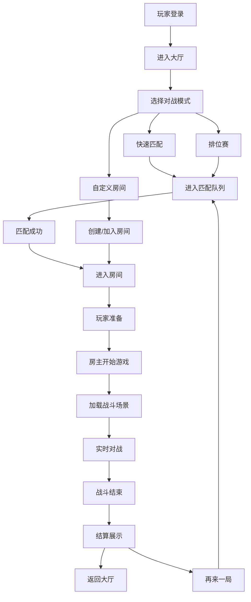

## 1. 产品概述

星云竞技场是一款多人实时联机竞技H5网页游戏，支持4~8名玩家同房间实时对战，采用科幻霓虹风格，玩家操控战机在竞技场中进行射击对战。游戏包含完整的匹配系统、房间系统、竞技结算、段位积分、商城道具、赛季排名等体系，支持跨终端（PC/手机）浏览器运行。

- 核心目标：打造高品质实时竞技体验，通过精准的操作、策略配合与道具运用获得胜利
- 目标用户：休闲竞技游戏爱好者，覆盖16~35岁年轻群体
- 市场价值：填补H5领域高品质实时竞技游戏的空白，凭借即开即玩的特性快速获客

## 2. 核心特性

### 2.1 用户角色

| 角色 | 注册方式 | 核心权限 |
|------|----------|----------|
| 普通玩家 | 游客登录/账号登录 | 匹配对战、房间创建、道具购买、段位冲分 |
| 组队队长 | 普通玩家升级 | 邀请好友、匹配模式选择、房间设置 |
| 运营管理员 | 后台账号登录 | 配置管理、玩家封禁、道具补发、数据查询 |

### 2.2 功能模块

1. **大厅主页**：玩家信息展示、快速匹配入口、模式选择、活动公告
2. **匹配系统**：随机匹配、组队匹配、排位匹配、匹配等待与取消
3. **房间系统**：自定义房间、房间设置、玩家准备、房间聊天
4. **战斗场景**：实时对战、技能释放、道具使用、战斗HUD
5. **结算界面**：战斗数据统计、胜负判定、积分变化、奖励展示
6. **排位系统**：段位展示、积分详情、赛季排名、赛季奖励
7. **商城系统**：道具购买、皮肤购买、充值中心、背包管理
8. **个人中心**：玩家信息、战绩记录、成就系统、设置选项
9. **运营后台**：参数配置、玩家管理、数据监控、操作审计

### 2.3 页面详情

| 页面名称 | 模块名称 | 功能描述 |
|---------|----------|----------|
| 登录页 | 登录模块 | 游客登录、账号登录、注册入口、协议勾选 |
| 大厅主页 | 顶部导航 | 玩家头像、昵称、段位、金币钻石、设置按钮 |
| 大厅主页 | 模式选择 | 快速匹配、排位赛、自定义房间、组队大厅 |
| 大厅主页 | 活动公告 | 轮播公告、活动入口、赛季信息 |
| 大厅主页 | 底部菜单 | 首页、对战、商城、排行、我的 |
| 匹配等待页 | 匹配信息 | 匹配模式、等待时间、已匹配人数、取消按钮 |
| 房间页 | 房间信息 | 房间号、模式、人数上限、房间设置 |
| 房间页 | 玩家列表 | 玩家头像、昵称、段位、准备状态、房主标识 |
| 房间页 | 聊天区 | 房间内文字聊天、表情发送 |
| 房间页 | 操作区 | 准备/取消准备、开始游戏、邀请好友、退出房间 |
| 战斗页 | 战斗画布 | Canvas/WebGL渲染游戏场景、玩家角色、弹幕、特效 |
| 战斗页 | 战斗HUD | 血量条、能量条、技能CD、小地图、击杀信息、计时器 |
| 战斗页 | 道具栏 | 已装备道具展示、快捷使用、道具数量 |
| 结算页 | 胜负展示 | 胜利/失败动画、MVP标识、战绩总览 |
| 结算页 | 数据统计 | 击杀、死亡、助攻、伤害、治疗、经济等详细数据 |
| 结算页 | 积分变化 | 段位积分加减、晋级/降级提示、荣誉点变化 |
| 结算页 | 奖励展示 | 金币、经验、道具奖励、宝箱奖励 |
| 排位页 | 段位展示 | 当前段位、段位图标、当前积分、下一段位进度 |
| 排位页 | 赛季信息 | 赛季名称、剩余时间、赛季奖励 |
| 排位页 | 排行榜 | 全区排行、好友排行、自身排名 |
| 商城页 | 道具商城 | 道具分类、道具列表、道具详情、购买按钮 |
| 商城页 | 皮肤商城 | 皮肤展示、试穿、购买、已拥有标识 |
| 商城页 | 充值中心 | 充值档位、首充双倍、VIP特权 |
| 个人中心页 | 玩家信息 | 头像、昵称、ID、等级、经验条 |
| 个人中心页 | 战绩记录 | 历史对战列表、胜负统计、详细战报 |
| 个人中心页 | 成就系统 | 成就列表、进度展示、成就奖励领取 |
| 个人中心页 | 背包系统 | 道具背包、皮肤背包、道具使用/装备 |
| 个人中心页 | 设置选项 | 音效设置、画质设置、操作设置、账号设置 |
| 运营后台 | 登录页 | 管理员登录、权限验证 |
| 运营后台 | 仪表盘 | 在线人数、对战场次、营收数据、异常告警 |
| 运营后台 | 配置中心 | 游戏参数、段位规则、道具属性、活动配置 |
| 运营后台 | 玩家管理 | 玩家查询、封禁/解封、禁言、道具补发 |
| 运营后台 | 数据查询 | 对战记录、积分流水、道具流水、操作日志 |

## 3. 核心流程

### 3.1 匹配对战流程

玩家打开游戏 → 登录/游客登录 → 进入大厅 → 选择对战模式（快速/排位/自定义）→ 进入匹配队列 → 匹配成功 → 进入房间 → 玩家准备 → 房主开始游戏 → 加载战斗场景 → 实时对战 → 战斗结束 → 结算展示 → 返回大厅/再来一局

### 3.2 Mermaid流程图

### 3.3 战斗同步流程

客户端输入 → 客户端预测 → 指令上报 → 服务端校验 → 服务端物理计算 → 状态广播 → 客户端插值渲染 → 状态修正

### 3.4 反作弊检测流程

客户端指令上报 → 服务端接收 → 合法性校验（位置/速度/伤害）→ 异常行为检测 → 命中作弊规则 → 实时处罚（警告/封禁）→ 日志记录 → 人工复核

## 4. 用户界面设计

### 4.1 设计风格

- **设计风格**：科幻霓虹风格（Sci-fi Neon），深色背景配合霓虹光效，营造未来科技感
- **主色调**：深空蓝（#0a0e27）作为背景主色，霓虹青（#00f0ff）作为主交互色
- **辅助色**：霓虹粉（#ff00ff）、霓虹紫（#8b5cf6）、霓虹绿（#00ff88）、霓虹橙（#ff6b35）
- **中性色**：深灰（#1a1f3a）、中灰（#2d3561）、浅灰（#4a5585）、文字白（#e8ecff）
- **按钮风格**：圆角矩形按钮，带有霓虹外发光效果，按下时有内发光反馈
- **字体**：主标题使用Orbitron（科幻感字体），正文使用Rajdhani（清晰易读的等宽风格字体）
- **布局风格**：卡片式布局，每个模块有半透明玻璃质感背景，边缘霓虹描边
- **图标风格**：线性霓虹图标，带有轻微外发光效果

### 4.2 页面设计概览

| 页面名称 | 模块名称 | UI元素 |
|---------|----------|--------|
| 登录页 | 登录模块 | 星空背景动画、霓虹Logo、发光输入框、脉冲登录按钮、粒子特效 |
| 大厅主页 | 顶部导航 | 玻璃质感顶栏、玩家头像带段位边框、资源展示带图标、发光设置按钮 |
| 大厅主页 | 模式选择 | 四大模式卡片、悬浮放大效果、霓虹边框高亮、模式图标+名称 |
| 大厅主页 | 活动公告 | 轮播图、霓虹渐变文字、活动角标 |
| 大厅主页 | 底部菜单 | 玻璃质感底栏、图标+文字、选中态霓虹高亮 |
| 匹配等待页 | 匹配信息 | 旋转霓虹圆环动画、匹配进度条、脉冲等待提示、取消按钮 |
| 房间页 | 玩家列表 | 玩家卡片网格、头像带段位边框、准备状态发光指示、房主皇冠标识 |
| 房间页 | 聊天区 | 半透明聊天气泡、玩家名颜色区分、滚动动画 |
| 战斗页 | 战斗画布 | 深色星空背景、霓虹战机、弹幕光效、爆炸粒子、拖尾效果 |
| 战斗页 | 战斗HUD | 左上血量能量条、右上小地图、底部技能栏、中央击杀播报 |
| 结算页 | 胜负展示 | 巨大胜利/失败文字、霓虹光效迸发动画、MVP皇冠特效 |
| 结算页 | 数据统计 | 数据卡片网格、数值动画递增、条形图对比 |
| 排位页 | 段位展示 | 大型段位徽章、发光边框、积分进度条、段位名称 |
| 商城页 | 道具商城 | 道具卡片网格、悬浮放大效果、价格标签、购买按钮发光 |
| 个人中心页 | 玩家信息 | 大型头像卡片、段位展示、等级进度、数据概览 |
| 运营后台 | 仪表盘 | 数据卡片、折线图柱状图、实时数据更新、状态指示灯 |

### 4.3 响应式设计

- **设计原则**：桌面端优先，移动端自适应
- **布局适配**：大屏多列布局，小屏单列堆叠
- **战斗操作**：桌面端键盘+鼠标操作，移动端虚拟摇杆+技能按钮
- **触控优化**：移动端按钮最小尺寸48px，间距充足避免误触
- **性能适配**：根据设备性能自动调整画质（粒子数量、光效强度）

### 4.4 动效设计

- **页面切换**：淡入淡出 + 轻微缩放过渡
- **按钮交互**：悬浮放大、霓虹光效增强、按下内缩反馈
- **战斗特效**：子弹拖尾、爆炸粒子、击杀闪光、技能蓄力光效
- **数据变化**：数值滚动动画、进度条平滑过渡
- **加载动画**：旋转霓虹圆环、脉冲光点、进度条渐变

### 4.5 音效提示（设计预留）

- 按钮点击音效、匹配成功音效、战斗开始音效
- 射击音效、命中音效、击杀音效、死亡音效
- 胜利音效、失败音效、获得奖励音效
- 背景音乐：大厅轻松电子乐、战斗紧张电子乐
