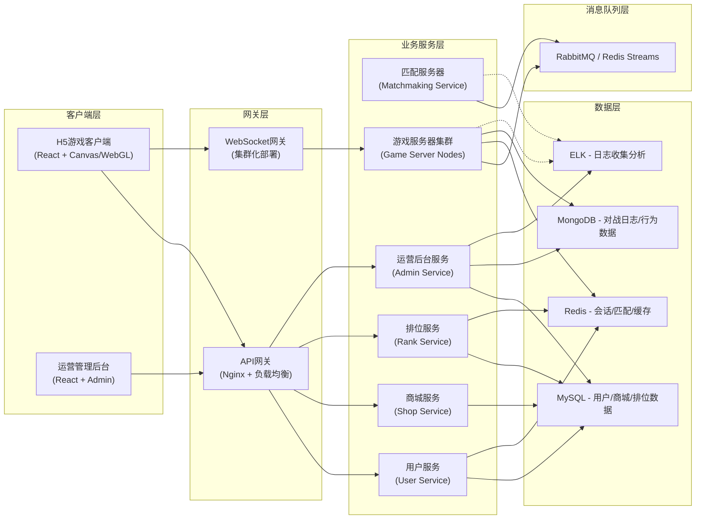
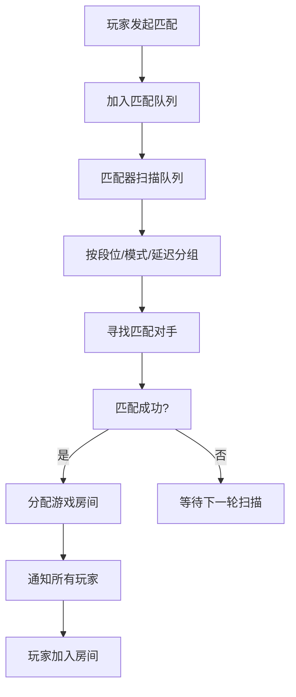
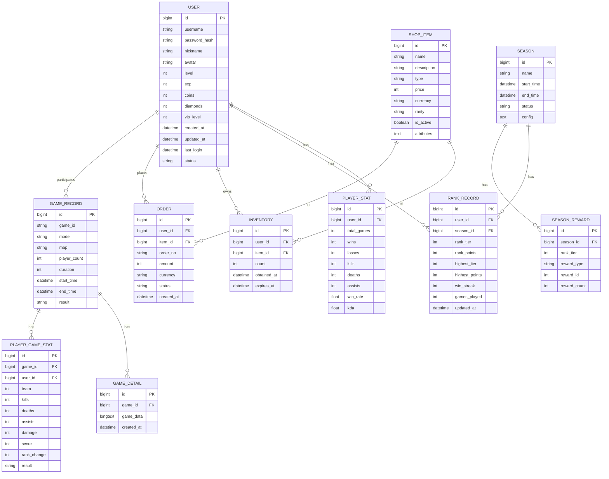
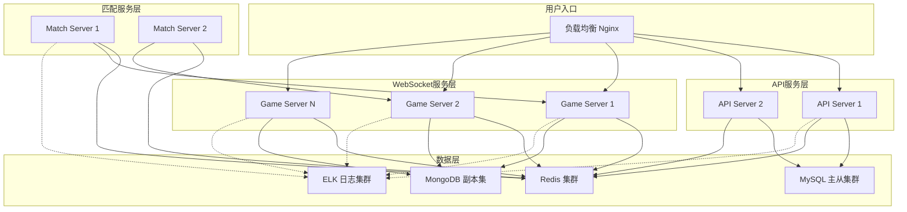

## 1. 架构设计

### 1.1 整体架构图



### 1.2 技术选型说明

| 层级 | 技术栈 | 选型理由 |
|------|--------|----------|
| H5前端 | React 18 + TypeScript + Vite + Canvas 2D | 组件化开发，Canvas高性能渲染游戏画面 |
| 管理后台 | React + TypeScript + Ant Design Pro | 成熟的企业级后台方案 |
| 游戏服务端 | Node.js + TypeScript + Socket.io | 事件驱动，高并发连接支持，与前端技术栈统一 |
| 匹配服务 | Node.js + BullMQ + Redis | 基于优先级队列的匹配算法，支持横向扩展 |
| API服务 | Express.js + TypeScript | 轻量高效的HTTP服务框架 |
| 数据库 | MySQL 8.0 | 结构化数据存储，事务支持 |
| 缓存 | Redis 7.x | 会话管理、匹配队列、排行榜缓存 |
| 日志库 | MongoDB + ELK Stack | 海量对战日志存储与分析 |
| 消息队列 | Redis Streams / BullMQ | 服务间异步通信，匹配任务分发 |
| 部署 | Docker + PM2 | 容器化部署，进程管理 |

## 2. 技术栈详细说明

### 2.1 前端技术栈

- **框架**: React 18 + TypeScript
- **构建工具**: Vite 5.x
- **状态管理**: Zustand
- **路由**: React Router v6
- **样式**: TailwindCSS 3.x
- **游戏渲染**: Canvas 2D API（备选：PixiJS）
- **网络通信**: Socket.io-client + Axios
- **UI组件**: 自研组件库（霓虹科幻风格）
- **图标**: Lucide React
- **动画**: CSS动画 + requestAnimationFrame
- **性能优化**: 对象池、离屏渲染、Web Worker

### 2.2 服务端技术栈

- **运行时**: Node.js 18+
- **语言**: TypeScript
- **HTTP框架**: Express.js
- **WebSocket**: Socket.io
- **进程管理**: PM2 / Cluster
- **验证**: JWT + bcrypt
- **ORM**: Prisma / TypeORM

### 2.3 数据库设计

- **MySQL**: 用户表、段位表、道具表、订单表、赛季表
- **Redis**: 用户会话、匹配队列、在线状态、排行榜缓存、房间状态
- **MongoDB**: 对战明细、战斗日志、行为审计、操作日志

## 3. 目录结构设计

```
project-root/
├── packages/                          # monorepo 多包管理
│   ├── client/                        # H5游戏客户端
│   │   ├── src/
│   │   │   ├── components/            # UI组件
│   │   │   ├── pages/                 # 页面组件
│   │   │   ├── game/                  # 游戏核心逻辑
│   │   │   │   ├── engine/            # 游戏引擎
│   │   │   │   ├── entities/          # 游戏实体
│   │   │   │   ├── systems/           # 游戏系统
│   │   │   │   └── renderer/          # 渲染器
│   │   │   ├── store/                 # 状态管理
│   │   │   ├── hooks/                 # 自定义Hooks
│   │   │   ├── utils/                 # 工具函数
│   │   │   ├── api/                   # API请求
│   │   │   ├── net/                   # 网络通信
│   │   │   ├── styles/                # 全局样式
│   │   │   └── assets/                # 静态资源
│   │   ├── public/
│   │   └── package.json
│   │
│   ├── game-server/                   # 游戏服务器
│   │   ├── src/
│   │   │   ├── game/                  # 游戏逻辑
│   │   │   │   ├── GameRoom.ts        # 游戏房间
│   │   │   │   ├── GameEngine.ts      # 游戏引擎
│   │   │   │   ├── entities/          # 实体定义
│   │   │   │   └── systems/           # 游戏系统
│   │   │   ├── net/                   # 网络层
│   │   │   │   ├── GameSocket.ts      # Socket处理
│   │   │   │   ├── Protocol.ts        # 协议定义
│   │   │   │   └── MessageQueue.ts    # 消息队列
│   │   │   ├── anticheat/             # 反作弊模块
│   │   │   │   ├── Detector.ts        # 作弊检测器
│   │   │   │   ├── Rules.ts           # 检测规则
│   │   │   │   └── Punishment.ts      # 处罚逻辑
│   │   │   ├── sync/                  # 状态同步
│   │   │   │   ├── StateSync.ts       # 状态同步
│   │   │   │   └── Interpolation.ts   # 插值补偿
│   │   │   └── utils/
│   │   └── package.json
│   │
│   ├── match-server/                  # 匹配服务器
│   │   ├── src/
│   │   │   ├── match/                 # 匹配逻辑
│   │   │   │   ├── Matcher.ts         # 匹配器
│   │   │   │   ├── MatchQueue.ts      # 匹配队列
│   │   │   │   └── MatchAlgorithm.ts  # 匹配算法
│   │   │   ├── room/                  # 房间管理
│   │   │   │   ├── RoomManager.ts     # 房间管理器
│   │   │   │   └── RoomAllocator.ts   # 房间分配器
│   │   │   └── api/                   # HTTP API
│   │   └── package.json
│   │
│   ├── api-server/                    # API业务服务器
│   │   ├── src/
│   │   │   ├── modules/
│   │   │   │   ├── user/              # 用户模块
│   │   │   │   ├── shop/              # 商城模块
│   │   │   │   ├── rank/              # 排位模块
│   │   │   │   └── season/            # 赛季模块
│   │   │   ├── middleware/            # 中间件
│   │   │   ├── utils/
│   │   │   └── app.ts
│   │   └── package.json
│   │
│   ├── admin-server/                  # 运营后台服务
│   │   ├── src/
│   │   │   ├── modules/
│   │   │   │   ├── config/            # 配置管理
│   │   │   │   ├── player/            # 玩家管理
│   │   │   │   ├── data/              # 数据查询
│   │   │   │   └── audit/             # 审计日志
│   │   │   └── app.ts
│   │   └── package.json
│   │
│   ├── admin-client/                  # 运营后台前端
│   │   ├── src/
│   │   └── package.json
│   │
│   └── shared/                        # 共享类型与常量
│       ├── types/                     # TypeScript类型定义
│       ├── constants/                 # 游戏常量配置
│       ├── enums/                     # 枚举定义
│       └── utils/                     # 通用工具函数
│
├── docker/                            # Docker配置
├── deploy/                            # 部署脚本
├── docs/                              # 文档
├── package.json                       # 根package.json (monorepo)
└── pnpm-workspace.yaml
```

## 4. 网络协议设计

### 4.1 WebSocket 协议

采用JSON格式，统一消息结构：

```typescript
interface GameMessage<T = any> {
  type: string;          // 消息类型
  seq: number;           // 序列号
  timestamp: number;     // 时间戳
  data: T;               // 消息数据
}
```

### 4.2 核心消息类型

| 方向 | 消息类型 | 说明 |
|------|----------|------|
| C→S | `player_input` | 玩家输入指令 |
| C→S | `player_skill` | 技能释放 |
| C→S | `player_item` | 道具使用 |
| C→S | `player_chat` | 聊天消息 |
| C→S | `heartbeat` | 心跳包 |
| S→C | `game_state` | 游戏状态快照 |
| S→C | `entity_update` | 实体更新（增量） |
| S→C | `player_joined` | 玩家加入 |
| S→C | `player_left` | 玩家离开 |
| S→C | `game_start` | 游戏开始 |
| S→C | `game_end` | 游戏结束 |
| S→C | `kill_event` | 击杀事件 |
| S→C | `damage_event` | 伤害事件 |
| S→C | `reconnect_state` | 重连恢复数据 |

### 4.3 状态同步策略

- **服务器频率**: 20 tick/s（每50ms一次全量状态同步）
- **增量同步**: 实体变化事件实时推送
- **客户端插值**: 100ms延迟插值，平滑渲染
- **客户端预测**: 本地输入预测，服务端回包后修正
- **指令确认**: 关键指令带seq，确保可靠性

## 5. 核心系统设计

### 5.1 匹配系统



**匹配算法**:
- 基于段位的ELO匹配
- 等待时间越久，匹配范围越宽
- 组队匹配按最高段位算
- 支持按延迟优先匹配

### 5.2 反作弊系统

**检测维度**:
1. **速度检测**: 移动速度超阈值检测
2. **伤害检测**: 异常伤害值检测
3. **频率检测**: 高频操作/指令检测
4. **位置检测**: 瞬移/穿墙检测
5. **行为检测**: 锁血/无敌检测
6. **数据校验**: 客户端数据一致性校验

**处罚分级**:
- 一级：警告 + 日志记录
- 二级：本局成绩无效
- 三级：临时封禁（24小时）
- 四级：永久封禁

### 5.3 弱网兼容

**策略**:
- **心跳检测**: 5秒心跳，15秒超时判定掉线
- **断线重连**: 30秒内重连恢复对局
- **指令重传**: 关键指令带ack，丢包自动重传
- **状态补全**: 重连时下发全量状态
- **延迟补偿**: 服务端回滚计算，修正伤害判定
- **抖动缓冲**: 客户端抖动缓冲区，平滑网络波动

### 5.4 段位系统

**段位等级**:
| 段位 | 名称 | 积分范围 |
|------|------|----------|
| 1 | 青铜 | 0 - 999 |
| 2 | 白银 | 1000 - 1999 |
| 3 | 黄金 | 2000 - 2999 |
| 4 | 铂金 | 3000 - 3999 |
| 5 | 钻石 | 4000 - 4999 |
| 6 | 大师 | 5000 - 5999 |
| 7 | 王者 | 6000+ (全服前100) |

**积分规则**:
- 胜利：+15~25分（根据对手段位差）
- 失败：-10~20分
- 连胜：额外加分
- 越级挑战：额外奖励/惩罚
- 赛季结算：按最高段位发放奖励

### 5.5 游戏核心玩法

**游戏类型**: 多人射击竞技
**人数**: 4~8人（个人竞技或团队竞技）
**时长**: 单局5~8分钟

**核心机制**:
- 玩家操控战机在2D竞技场中移动射击
- 普通射击无消耗，技能消耗能量
- 击杀敌人获得积分，死亡短暂复活
- 时间结束后按积分排名
- 支持个人战和组队战

## 6. API 接口定义

### 6.1 用户模块

| 接口 | 方法 | 说明 |
|------|------|------|
| `/api/user/guest-login` | POST | 游客登录 |
| `/api/user/login` | POST | 账号登录 |
| `/api/user/register` | POST | 账号注册 |
| `/api/user/info` | GET | 获取用户信息 |
| `/api/user/update` | POST | 更新用户信息 |

### 6.2 匹配模块

| 接口 | 方法 | 说明 |
|------|------|------|
| `/api/match/start` | POST | 开始匹配 |
| `/api/match/cancel` | POST | 取消匹配 |
| `/api/match/status` | GET | 匹配状态 |

### 6.3 商城模块

| 接口 | 方法 | 说明 |
|------|------|------|
| `/api/shop/items` | GET | 商品列表 |
| `/api/shop/buy` | POST | 购买商品 |
| `/api/shop/backpack` | GET | 背包列表 |
| `/api/shop/use-item` | POST | 使用道具 |

### 6.4 排位模块

| 接口 | 方法 | 说明 |
|------|------|------|
| `/api/rank/info` | GET | 排位信息 |
| `/api/rank/leaderboard` | GET | 排行榜 |
| `/api/rank/history` | GET | 排位历史 |
| `/api/rank/season-info` | GET | 赛季信息 |

### 6.5 运营后台

| 接口 | 方法 | 说明 |
|------|------|------|
| `/api/admin/config/list` | GET | 配置列表 |
| `/api/admin/config/update` | POST | 更新配置 |
| `/api/admin/player/search` | GET | 玩家搜索 |
| `/api/admin/player/ban` | POST | 封禁玩家 |
| `/api/admin/player/give-item` | POST | 发放道具 |
| `/api/admin/game/list` | GET | 对局列表 |
| `/api/admin/game/detail` | GET | 对局详情 |
| `/api/admin/logs/audit` | GET | 操作日志 |

## 7. 数据模型设计

### 7.1 ER图



### 7.2 Redis 数据结构

| Key | 类型 | 说明 |
|-----|------|------|
| `session:{token}` | String | 用户会话 |
| `user:{id}:online` | String | 在线状态 |
| `match:queue:{mode}` | ZSet | 匹配队列（score为匹配时间） |
| `room:{id}` | Hash | 房间信息 |
| `room:{id}:players` | Set | 房间玩家 |
| `rank:leaderboard:{season}` | ZSet | 排行榜 |
| `config:{key}` | String | 配置缓存 |

### 7.3 MongoDB 集合

- `game_logs`: 对战行为日志（每玩家每条指令）
- `cheat_logs`: 反作弊检测日志
- `audit_logs`: 运营操作审计日志
- `chat_logs`: 聊天记录
- `system_logs`: 系统运行日志

## 8. 部署架构



**部署策略**:
- **游戏服**: 多实例部署，每实例承载100~200房间
- **匹配服**: 独立部署，按模式分区匹配
- **API服**: 无状态，横向扩展
- **数据库**: 主从复制 + 读写分离
- **Redis**: 集群模式，数据分片
- **容灾**: 服务健康检查，故障自动剔除

## 9. 性能优化方案

### 9.1 前端优化
- Canvas对象池，减少GC
- 离屏Canvas渲染静态元素
- Web Worker处理计算逻辑
- 资源预加载 + 懒加载
- 帧率自适应，设备性能分级

### 9.2 服务端优化
- Node.js Cluster多进程
- 内存对象池复用
- 批量DB操作
- Redis Pipeline
- 异步日志写入

### 9.3 网络优化
- 消息合并，减少小包
- 增量同步，减少数据量
- 协议压缩（gzip/二进制）
- CDN加速静态资源
- 边缘节点部署游戏服
